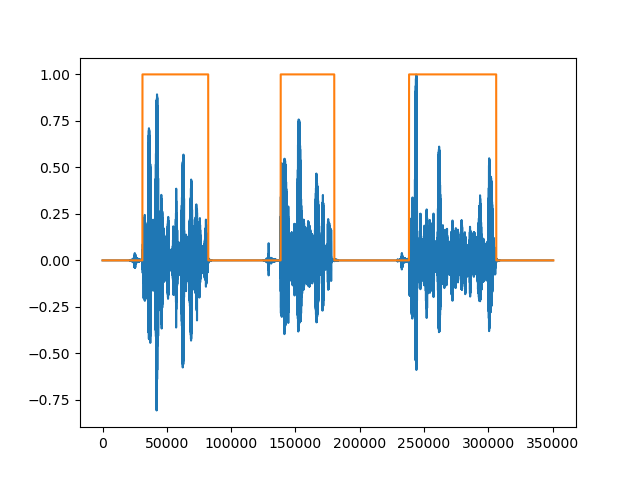

# Official PyTorch Implementation of "[An Efficient Transformer-Based Model for Voice Activity Detection](https://ieeexplore.ieee.org/document/9943501)"

<table>
  <tr>
    <td>
    <td>
  </tr>
</table>


## Abastract
Voice Activity Detection (VAD) aims to distinguish, at a given time, between desired speech and non-speech. Although many state-of-the-art approaches for increasing the performance of VAD have been proposed, they are still not robust enough to be applied under adverse noise conditions with low Signal-to-Noise Ratio (SNR). To deal with this issue, we propose a novel transformer-based architecture for VAD with reduced computational complexity by implementing efficient depth-wise convolutions on feature patches. The proposed model, named Tr-VAD, demonstrates better performance compared to baseline methods from the literature in a variety of scenarios considered with the smallest possible number of parameters. The results also indicate that the use of a combination of Audio Fingerprinting (AFP) features with Tr-VAD can guarantee better performance.

## How to run?
- Requirement:
  python version >= 3.7.
  ```bash
    pip install -r requirements.txt
  ```
- Dataset download and unzip.
- Clone the repo.
  ```bash
  git clone https://github.com/Yifei-ZHAO96/Tr-VAD.git
  cd Tr-VAD
  ```
- Data Preparation.
  ```bash
  # requires TIMIT dataset and noise dataset being downloaded and unzipped first  
  python data_gen.py <path/to/TIMIT/dataset> <path/to/noise/dataset> -sr 16000 -silence_pad 1
  ```
  - For more information, please read the instructions in `data_generation/README.md`.
- Training
  - Setup hyper-parameters in `params.py`.
  - Run script
  ```bash
  python train.py --train_data_path 'XXX'
  ```
- Inference
  ```bash
  python inference.py --input_path './data_test/[NOISE]61-70968-0000_SNR(00)_airport.WAV' --checkpoint_path './checkpoint/weights_10_acc_97.09.pth'
  ```

## Dataset Preparation
- [TIMIT Dataset](https://academictorrents.com/details/34e2b78745138186976cbc27939b1b34d18bd5b3)
- [LibriSpeech Dataset](https://www.openslr.org/12)
- [Noise Dataset](https://github.com/speechdnn/Noises/tree/master), including `Noise15`, `Noisex92` and `Nonspeech` noises.

## Examples
### Sample 1
<div style="text-align:center;">
  <table>
    <tr>
      <td><br>Clean Audio (from LibriSpeech test-clean `61-70968-0000.flac`.)</td>
      <td><br>Noisy Audio with AURORA `airport` Noise, SNR=0dB.</td>
    </tr>
  </table>
<div>

### Sample 2
<div style="text-align:center;">
  <table>
    <tr>
      <td><br>Clean Audio (from TIMIT TEST, padded with 1s silence before and after the utterance.)</td>
      <td><br>Noisy Audio with AURORA `airport` Noise, SNR=0dB.</td>
    </tr>
  </table>
<div>

### Sample 3, from [Paper](https://ieeexplore.ieee.org/document/9943501)
<div style="text-align:center;">
  <table>
    <tr>
      <td><br>Comparison of Performance of Different VAD Models.</td>
    </tr>
  </table>
<div>

## Note
- The model is trained on a mini-batch of 512, sampling rate of 16000, window step of 256, (equivalent to 512 * 256 / 16000 ~= 8.2 seconds), if you want to apply to scenarios with higher sampling rate, much longer duration of audios, you may need to adjust the batch size and learning rate and retrain the model.
- Evaluation of the model is also based on the parameter settings as explained in the paper.

## Hardware Requirements
- GPU: Cuda memory >= 8GB
- Storage >= 100GB (Storing training data)

## Citation
- BibTeX
  ```
  @INPROCEEDINGS{9943501,
  author={Zhao, Yifei and Champagne, Benoit},
  booktitle={2022 IEEE 32nd International Workshop on Machine Learning for Signal Processing (MLSP)}, 
  title={An Efficient Transformer-Based Model for Voice Activity Detection}, 
  year={2022},
  volume={},
  number={},
  pages={1-6},
  keywords={Voice activity detection;Convolution;Computational modeling;Machine learning;Fingerprint recognition;Predictive models;Transformers;Feature extraction;Computational complexity;Signal to noise ratio;Voice activity detection;transformer-based architecture;audio fingerprinting},
  doi={10.1109/MLSP55214.2022.9943501}}
  ```